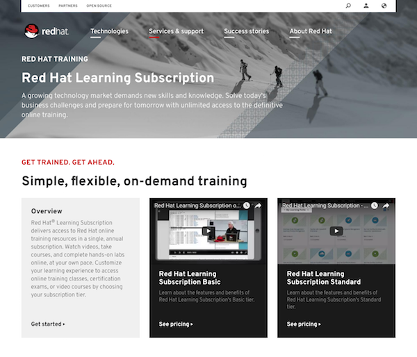
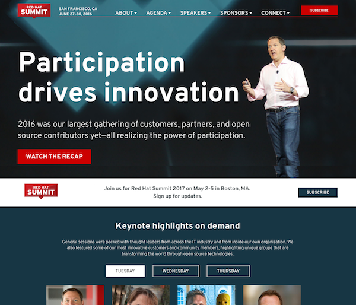

::: band #about |use-grid

    

        

            
        

    

    <h2 class="header-headline accent shown-text">About castastrophe</h2>
    <h2 class="header-headline accent hidden-text">Cassondra Roberts</h2>
    
I am a <b>passionate</b> front-end architect &amp; technical lead at <a
            href="https://www.redhat.com/en/about/company">Red&nbsp;Hat</a> on the Digital Marketing Strategy &amp;
        Design team, where we build the design system that powers many of Red&nbsp;Hat's web assets.

    
<b class="extra">Nothing makes me happier than exploring new technologies and implementing
            highly-optimized, clean solutions to complex problems.</b>

    
<b>Developer experience and accessibility are deeply important to me</b> and these values
        guide the code that I produce and influence. One of the most enjoyable aspects of my job is open source
        community management; engaging with and connecting the contributors to many of Red Hat's open initiatives.

<section data-layout="flex-centered">
    <pfe-card class="quote shown">
        <blockquote id="quote">
            

                
You're not going to learn code by passively watching someone
                    else write it. You have to get into it, get really tangled up in it, and ask how you
                    could make it better.

            

            
Collaborative Problem Solver 
                
                    <a href="https://www.meredith.edu/goingstrong/cas-roberts">Meredith Magazine</a>
                
            

        </blockquote>
    </pfe-card>
    <pfe-card color="accent" tilt-on="hover" class="featured">
        <h3 class="card-header-title">Design system</h3>
        <h4 class="card-header-headline" style="font-size: 22px;"><a
                href="https://github.com/patternfly/patternfly-elements" title="Click to view project">PatternFly
                Elements</a></h4>
        

            

                
This is a web component implementation of the Red Hat design system. It leverages the
                    encapsulation of ShadowDOM and the
                    power of custom properties to create well-scoped elements that are still
                    designer-friendly. Elements are accessible, context-aware, and framework-friendly!
                

            

        

        <pfe-cta slot="pfe-card--footer">
            <a class="cta-link" href="https://github.com/patternfly/patternfly-elements" title="Click to view project"
                data-cta-type="secondary">View the source code</a>
        </pfe-cta>
    </pfe-card>
</section>
:::

::: band #teaser |color=accent |data-padding=half

    

        

            

                <h3 class="promo-headline"><a
                        href="https://events.drupal.org/seattle2019/sessions/unlocking-design-design-system-custom-properties">Unlocking
                        design in a design system with custom properties</a>
                </h3>
                
DrupalCon 2019 | Seattle, WA

            

            

                <pfe-cta data-cta-type="video-play" style="font-size: 20px;">
                    <a class="cta-link" data-popup="youtube" href="https://www.youtube.com/embed/xH2MmVNuSe4">Watch
                        now</a>
                </pfe-cta>
            

        

    

:::

::: band .hidden
<h2 slot="pfe-band--header" class="header-title">Experience & passion</h2>

I've spent 7+ years at Red Hat investing in building
    design systems that work for designers, developers, content writers, and users alike. <b>My most
        valuable tool in this endeavor has always been active listening.</b> I ask a lot of questions
    and work hard to understand what we're really trying to solve, for the business and for the user.
    Making tools that are fun and easy for developers is important to me and hopefully makes what I
    build an obvious choice over the option to "reinvent the wheel". If I do my job right, I let
    developers and designers work on cutting-edge work instead of having to construct the building
    blocks from stratch.

<pfe-tabs vertical tab-history variant="wind" style="--pfe-tabs__panel--Padding:0" class="print-hidden"
    id="job-history">
    <pfe-tab role="heading" slot="tab" id="RedHat">Red Hat</pfe-tab>
    <pfe-tab-panel role="region" slot="panel">
        <pfe-accordion disclosure="true">
            <pfe-accordion-header>
                <h3>Principal front-end architect, User Experience Team, Digital Marketing</h3>
            </pfe-accordion-header>
            <pfe-accordion-panel>
                <dl>
                    <dd>Apr 2020&mdash;Now</dd>
                    <dd>
                        <ul>
                            <li>Open source community leader for PatternFly Elements and several
                                repositories under the Red Hat Official organization; this involves
                                responding to issues, code review, facilitating contribution through
                                documentation, encouraging a healthy, positive community, building out
                                project roadmaps, and getting stakeholder buy-in to fund dedicated
                                developers.</li>
                            <li>Research and engage with the web component community around
                                accessibility standards and approaches to theming components in
                                distributed architectures.</li>
                            <li>Heavily engaged in the CSS Working Group and on GitHub for web component
                                standards.</li>
                            <li>Engage designers, developers, and stakeholders in prioritization for
                                building out a varied and robust set of design system components.</li>
                            <li>Cross-organization collaboration with development and design teams, both
                                internal to Red Hat and with other large organizations such as Google,
                                Fidelity, Penn State, and IBM.</li>
                        </ul>
                    </dd>
                </dl>
            </pfe-accordion-panel>
            <pfe-accordion-header>
                <h3>Senior front-end architect, Digital Marketing Strategy & Design</h3>
            </pfe-accordion-header>
            <pfe-accordion-panel>
                <dl>
                    <dd>Dec 2017&mdash;Apr 2020</dd>
                    <dd>
                        <ul>
                            <li>Co-founder of PatternFly Elements</li>
                            <li>Technical lead for the redhat.com pattern library, which is used across
                                multiple web assets within Red Hat; said library includes semantic
                                markup, JavaScript interactions, JSON schemas for CMS consumption and
                                JSON data for testing framework, and JavaScript (Mocha/Chai) for
                                front-end visual regression testing.</li>
                            <li>Primarily responsible for code review and providing guidance, training,
                                and feedback to pattern system contributors and front-end developers for
                                redhat.com; organize cross-team training.</li>
                            <li>Expert-level Sass developer; optimizing CSS and making the system easy
                                to use and update</li>
                            <li>Manage requirements, hours, testing, and deliverables via Rally, a
                                project management tool, helping teammates with efficient timekeeping
                                and working across our larger team to build templates and improve the
                                efficiency of our reporting.</li>
                            <li>Agile team structure allows us to iterate on patterns quickly and
                                provide continual improvements to our system.</li>
                            <li>Cross-browser testing, using site analytics to determine support levels.
                            </li>
                            <li>Manage the build server including debugging any build issues, package
                                and upgrade management.</li>
                            <li>Present our team's approaches, methodologies, and theories at technical
                                conferences and bring back shared knowledge for implementation in our
                                system.</li>
                            <li>Mentor fellow developers and students on technical and professional
                                skillsets.</li>
                        </ul>
                    </dd>
                </dl>
            </pfe-accordion-panel>
            <pfe-accordion-header>
                <h3>Front-end developer, UX Development tech lead</h3>
            </pfe-accordion-header>
            <pfe-accordion-panel>
                <dl>
                    <dd>May 2016&mdash;Dec 2017</dd>
                    <dd>
                        <ul>
                            <li>Lead, advocate, architect, and developed for a new component-driven
                                design system; advanced Twig templating, Grunt tasks and logic,
                                WebdriverIO for visual regression testing, advanced Sass functions and
                                mixins.</li>
                            <li>Manage the build server including debugging any build issues, package
                                and upgrade management.</li>
                            <li>Owner of front-end JavaScript for the web team; set and documented
                                coding standards and built large library of include-able snippets for
                                modular UI development.</li>
                            <li>Advocate and early adopter of flexible templating system for Drupal
                                (utilizes the paragraph module); tech lead writing schemas which drive
                                the admin interface, twig templates, and styles for this system.</li>
                            <li>Consult for other divisions concerning front-end user experience and
                                design, including providing CSS styling, helping create mobile-friendly
                                applications, and improve customer engagement.</li>
                        </ul>
                    </dd>
                </dl>
            </pfe-accordion-panel>
            <pfe-accordion-header>
                <h3>User experience web developer/designer</h3>
            </pfe-accordion-header>
            <pfe-accordion-panel>
                <dl>
                    <dd>Jan 2014&mdash;May 2016</dd>
                    <dd>
                        <ul>
                            <li>Lead developer for Red Hat Summit's Drupal templates in PHP, outputs
                                logic-based mark-up based on an API feed from Lanyon.</li>
                            <li>Design and build microsites advertising products and services - using
                                thorough knowledge of HTML, Sass (and by-proxy, CSS), JavaScript.</li>
                            <li>Web lead for the web design and organization of the Training and About
                                sections for redhat.com.</li>
                            <li>Building pages for major site redesign project in Drupal using Sass,
                                HTML (with some HTML5 components) and advanced Javascript tools to
                                create clean, efficient, modular design with sustainable code
                                (development tools used: Compass, Jekyll, Gitlab).</li>
                            <li>Expertly managed the ticket queue for redhat.com main page and
                                microsites, resolving web issues for customers and communicating with
                                colleagues to maintain tight SLAs with excellent customer service,
                                received several service awards for this work.</li>
                            <li>Managed content using CVS, then transitioned the team to git; took the
                                lead in creating documentation and workflows, provided hands-on training
                                to the team; wrote a few bash wrapper scripts to standardize process and
                                workflows.</li>
                            <li>Consult for other divisions concerning front-end user experience and
                                design, including providing CSS styling, helping create mobile-friendly
                                applications, and improve customer engagement.</li>
                            <li>Business Analyst for Red Hat's online product store (and previously,
                                Customer Portal).</li>
                        </ul>
                    </dd>
                </dl>
            </pfe-accordion-panel>
        </pfe-accordion>
    </pfe-tab-panel>
    <pfe-tab role="heading" slot="tab" id="SAS">SAS</pfe-tab>
    <pfe-tab-panel role="region" slot="panel">
        <pfe-accordion>
            <pfe-accordion-header>
                <h3>Associate Technical Consultant</h3>
            </pfe-accordion-header>
            <pfe-accordion-panel>
                <dl>
                    <dd>Feb 2013&mdash;Jan 2014</dd>
                    <dd>
                        <ul>
                            <li>Consult customers using SAS with a third-party database, SQL
                                optimization expertise.</li>
                            <li>Demo SAS products to customers, explaining different methods of creating
                                a cohesive framework for data collection and management.</li>
                            <li>Experience with the full range of SAS Software - including Visual
                                Analytics, DataFlux, Data Integration Studio, and related business
                                tools.</li>
                            <li>Database optimization via DBMS and SAS code.</li>
                            <li>In-Database, In-Memory, High Performance Analytics - Teradata, Hadoop.
                            </li>
                            <li>Oracle Database Administrator consult for large-scale, long-term
                                project.</li>
                            <li>Research emerging technologies, internally and externally, to develop
                                Best Practice and training documentation.</li>
                        </ul>
                    </dd>
                </dl>
            </pfe-accordion-panel>
            <pfe-accordion-header>
                <h3>Associate Development Tester</h3>
            </pfe-accordion-header>
            <pfe-accordion-panel>
                <dl>
                    <dd>Jan 2012&mdash;Nov 2012</dd>
                    <dd>
                        <ul>
                            <li>Maintain physical & virtual Windows, Linux, HP images used in regression
                                tests, includes maintaining software updates & installing testing tools.
                            </li>
                            <li>Write, implement, & trouble-shoot regression tests, client &
                                server-side.</li>
                            <li>Develop & monitor testing plans.</li>
                            <li>Perform, document deployment for embedded processing on the following
                                databases: Aster, DB2 on AIX, DB2 on Linux, Greenplum, Netezza,
                                Teradata, Hadoop, Oracle.</li>
                            <li>Manage MLE, macro, and international test suites for model processing
                                in-database, about 300 tests, with bash script reporting results.</li>
                            <li>Design advanced web reporting tools using heavy PHP, CSS framework, Perl
                                script backend that queries status & details across multiple server
                                platforms based on information collected with an internal web crawler.
                            </li>
                            <li>Upgrade & maintain a myriad of databases assigned to my testing group.
                            </li>
                            <li>Programmed tests using SAS language, macros, & SQL.</li>
                        </ul>
                    </dd>
                </dl>
            </pfe-accordion-panel>
            <pfe-accordion-header>
                <h3>R&D Technical Student on In-Database Products</h3>
            </pfe-accordion-header>
            <pfe-accordion-panel>
                <dl>
                    <dd>May 2010&mdash;Jan 2012</dd>
                    <dd>
                        <ul>
                            <li>Develop automated reporting tools on the status of various database
                                platforms.</li>
                            <li>Develop Linux scripting tools to increase efficiency of
                                common/repetitive tasks.</li>
                            <li>Regular installs on test environments for testing teams, both client &
                                server side.</li>
                            <li>Testing & documenting install process for Linux & PC hosts.</li>
                            <li>Programmed tests using SAS language, macros, & SQL.</li>
                            <li>Improve online reporting tools & documentation, introduced PHP reporting
                                to the group.</li>
                            <li>Designed advanced training programs for international resources.</li>
                        </ul>
                    </dd>
                </dl>
            </pfe-accordion-panel>
        </pfe-accordion>
    </pfe-tab-panel>
    <pfe-tab role="heading" slot="tab" id="Other">Other</pfe-tab>
    <pfe-tab-panel role="region" slot="panel">
        <pfe-accordion>
            <pfe-accordion-header>
                <h3>Publishing | Journals Production Editor, Oxford University Press</h3>
            </pfe-accordion-header>
            <pfe-accordion-panel>
                <dl>
                    <dd>Sep 2007&mdash;Jul 2009</dd>
                    <dd>This position changed the course of my career. After completing a summer
                        internship, I accepted a full-time position with this group; pausing my progress
                        on an English degree from NC State for a chance to get real professional
                        experience. Instead, what I learned was that publishing is 80% project
                        management and only 20% actual editing; more than that, I enjoyed it! When the
                        group rolled out a new software for tracking publications, I threw myself into
                        detailed product testing and realized my love of computers could be a career.
                        That led me back to college at Meredith to complete a Bachelors of Science in
                        Computer Science by 2012. <a class="read-more">Read more.</a></dd>
                    <dd hidden>
                        <ul>
                            <li>Contributed to cohesive team structure and was highly efficient on
                                independent tasks.</li>
                            <li>Heavily involved in regression testing and improving Journal management
                                software, taking a leadership role in both tasks and mining information
                                from US and UK offices to make the program more efficient and effective.
                            </li>
                            <li>Created and monitored schedules and turnaround times, ensuring tight
                                deadlines are met.</li>
                            <li>Created and monitored budgets up to $605,500/journal, effectively
                                cutting costs while working to improve the physical quality of
                                publication.</li>
                            <li>Generated weekly, monthly, and year-end reporting on the overall status
                                of each journal.</li>
                            <li>Liaised between editors, authors, and other departments within Oxford UP
                                to provide excellent customer service and facilitate the smooth
                                development of publication.</li>
                        </ul>
                    </dd>
                </dl>
            </pfe-accordion-panel>
            <pfe-accordion-header>
                <h3>Startup | Jr Web Developer, FlipKey</h3>
            </pfe-accordion-header>
            <pfe-accordion-panel>
                <dl>
                    <dd>Nov 2012&mdash;Jan 2013</dd>
                    <dd>This role taught me a lot about web development and was my first experience
                        professionally writing PHP. I got to experience the energy and innovation of a
                        startup with the benefits of working right in downtown Boston, MA; still one of
                        my favorite cities to this day. <a class="read-more">Read more.</a></dd>
                    <dd hidden>
                        <ul>
                            <li>CakePHP environment, PHP5.</li>
                            <li>Write and debug HTML5 and SCSS front-end.</li>
                            <li>Documenting processes by compiling information from key resources on the
                                development team.</li>
                            <li>Grep log files to fix errors or insert additional logging.</li>
                            <li>Install and configure Linux-based test and development environment,
                                including but not limited to: MySQL, Sphinx, Redis, Mercurial VCS,
                                Coffeescript, Compass, Couchbase.</li>
                            <li>Light Python scripting to configure and populate memcache buckets in
                                Couchbase and to deploy development to test and production environment.
                            </li>
                        </ul>
                    </dd>
                </dl>
            </pfe-accordion-panel>
            <pfe-accordion-header>
                <h3>Family-owned | Web Content Manager, Inside-Out Sports</h3>
            </pfe-accordion-header>
            <pfe-accordion-panel>
                <dl>
                    <dd>Aug 2009&mdash;Jul 2010</dd>
                    <dd>This was a great experience working for a small, family-owned, local company
                        helping them to realize the possibilities of hosting their content on the web.
                        <a class="read-more">Read more.</a></dd>
                    <dd hidden>
                        <ul>
                            <li>Create and update product images and descriptions for the Online Store.
                            </li>
                            <li>Research and implement new tools for online shopping, including
                                JavaScript applets.</li>
                            <li>Unify appearance of products using HTML.</li>
                            <li>Managed one employee which involved training, reviewing, and personnel
                                issues.</li>
                        </ul>
                    </dd>
                </dl>
            </pfe-accordion-panel>
        </pfe-accordion>
    </pfe-tab-panel>
</pfe-tabs>

    

        <h3>Red Hat</h3>
        <pfe-accordion disclosure="true">
            <pfe-accordion-header>
                <h3>Principal front-end architect, User Experience Team, Digital Marketing</h3>
            </pfe-accordion-header>
            <pfe-accordion-panel>
                <dl>
                    <dd>Apr 2020&mdash;Now</dd>
                    <dd>
                        <ul>
                            <li>Open source community leader for PatternFly Elements and several
                                repositories under the Red Hat Official organization; this involves
                                responding to issues, code review, facilitating contribution through
                                documentation, encouraging a healthy, positive community, building out
                                project roadmaps, and getting stakeholder buy-in to fund dedicated
                                developers.</li>
                            <li>Research and engage with the web component community around
                                accessibility standards and approaches to theming components in
                                distributed architectures.</li>
                            <li>Heavily engaged in the CSS Working Group and on GitHub for web component
                                standards.</li>
                            <li>Engage designers, developers, and stakeholders in prioritization for
                                building out a varied and robust set of design system components.</li>
                            <li>Cross-organization collaboration with development and design teams, both
                                internal to Red Hat and with other large organizations such as Google,
                                Fidelity, Penn State, and IBM.</li>
                        </ul>
                    </dd>
                </dl>
            </pfe-accordion-panel>
            <pfe-accordion-header>
                <h3>Senior front-end architect, Digital Marketing Strategy & Design</h3>
            </pfe-accordion-header>
            <pfe-accordion-panel>
                <dl>
                    <dd>Dec 2017&mdash;Apr 2020</dd>
                    <dd>
                        <ul>
                            <li>Co-founder of PatternFly Elements</li>
                            <li>Technical lead for the redhat.com pattern library, which is used across
                                multiple web assets within Red Hat; said library includes semantic
                                markup, JavaScript interactions, JSON schemas for CMS consumption and
                                JSON data for testing framework, and JavaScript (Mocha/Chai) for
                                front-end visual regression testing.</li>
                            <li>Primarily responsible for code review and providing guidance, training,
                                and feedback to pattern system contributors and front-end developers for
                                redhat.com; organize cross-team training.</li>
                            <li>Expert-level Sass developer; optimizing CSS and making the system easy
                                to use and update</li>
                            <li>Manage requirements, hours, testing, and deliverables via Rally, a
                                project management tool, helping teammates with efficient timekeeping
                                and working across our larger team to build templates and improve the
                                efficiency of our reporting.</li>
                            <li>Agile team structure allows us to iterate on patterns quickly and
                                provide continual improvements to our system.</li>
                            <li>Cross-browser testing, using site analytics to determine support levels.
                            </li>
                            <li>Manage the build server including debugging any build issues, package
                                and upgrade management.</li>
                            <li>Present our team's approaches, methodologies, and theories at technical
                                conferences and bring back shared knowledge for implementation in our
                                system.</li>
                            <li>Mentor fellow developers and students on technical and professional
                                skillsets.</li>
                        </ul>
                    </dd>
                </dl>
            </pfe-accordion-panel>
            <pfe-accordion-header>
                <h3>Front-end developer, UX Development tech lead</h3>
            </pfe-accordion-header>
            <pfe-accordion-panel>
                <dl>
                    <dd>May 2016&mdash;Dec 2017</dd>
                    <dd>
                        <ul>
                            <li>Lead, advocate, architect, and developed for a new component-driven
                                design system; advanced Twig templating, Grunt tasks and logic,
                                WebdriverIO for visual regression testing, advanced Sass functions and
                                mixins.</li>
                            <li>Manage the build server including debugging any build issues, package
                                and upgrade management.</li>
                            <li>Owner of front-end JavaScript for the web team; set and documented
                                coding standards and built large library of include-able snippets for
                                modular UI development.</li>
                            <li>Advocate and early adopter of flexible templating system for Drupal
                                (utilizes the paragraph module); tech lead writing schemas which drive
                                the admin interface, twig templates, and styles for this system.</li>
                            <li>Consult for other divisions concerning front-end user experience and
                                design, including providing CSS styling, helping create mobile-friendly
                                applications, and improve customer engagement.</li>
                        </ul>
                    </dd>
                </dl>
            </pfe-accordion-panel>
            <pfe-accordion-header>
                <h3>User experience web developer/designer</h3>
            </pfe-accordion-header>
            <pfe-accordion-panel>
                <dl>
                    <dd>Jan 2014&mdash;May 2016</dd>
                    <dd>
                        <ul>
                            <li>Lead developer for Red Hat Summit's Drupal templates in PHP, outputs
                                logic-based mark-up based on an API feed from Lanyon.</li>
                            <li>Design and build microsites advertising products and services - using
                                thorough knowledge of HTML, Sass (and by-proxy, CSS), JavaScript.</li>
                            <li>Web lead for the web design and organization of the Training and About
                                sections for redhat.com.</li>
                            <li>Building pages for major site redesign project in Drupal using Sass,
                                HTML (with some HTML5 components) and advanced Javascript tools to
                                create clean, efficient, modular design with sustainable code
                                (development tools used: Compass, Jekyll, Gitlab).</li>
                            <li>Expertly managed the ticket queue for redhat.com main page and
                                microsites, resolving web issues for customers and communicating with
                                colleagues to maintain tight SLAs with excellent customer service,
                                received several service awards for this work.</li>
                            <li>Managed content using CVS, then transitioned the team to git; took the
                                lead in creating documentation and workflows, provided hands-on training
                                to the team; wrote a few bash wrapper scripts to standardize process and
                                workflows.</li>
                            <li>Consult for other divisions concerning front-end user experience and
                                design, including providing CSS styling, helping create mobile-friendly
                                applications, and improve customer engagement.</li>
                            <li>Business Analyst for Red Hat's online product store (and previously,
                                Customer Portal).</li>
                        </ul>
                    </dd>
                </dl>
            </pfe-accordion-panel>
        </pfe-accordion>
    

    

        <h3>SAS</h3>
        <pfe-accordion>
            <pfe-accordion-header>
                <h3>Associate Technical Consultant</h3>
            </pfe-accordion-header>
            <pfe-accordion-panel>
                <dl>
                    <dd>Feb 2013&mdash;Jan 2014</dd>
                    <dd>
                        <ul>
                            <li>Consult customers using SAS with a third-party database, SQL
                                optimization expertise.</li>
                            <li>Demo SAS products to customers, explaining different methods of creating
                                a cohesive framework for data collection and management.</li>
                            <li>Experience with the full range of SAS Software - including Visual
                                Analytics, DataFlux, Data Integration Studio, and related business
                                tools.</li>
                            <li>Database optimization via DBMS and SAS code.</li>
                            <li>In-Database, In-Memory, High Performance Analytics - Teradata, Hadoop.
                            </li>
                            <li>Oracle Database Administrator consult for large-scale, long-term
                                project.</li>
                            <li>Research emerging technologies, internally and externally, to develop
                                Best Practice and training documentation.</li>
                        </ul>
                    </dd>
                </dl>
            </pfe-accordion-panel>
            <pfe-accordion-header>
                <h3>Associate Development Tester</h3>
            </pfe-accordion-header>
            <pfe-accordion-panel>
                <dl>
                    <dd>Jan 2012&mdash;Nov 2012</dd>
                    <dd>
                        <ul>
                            <li>Maintain physical & virtual Windows, Linux, HP images used in regression
                                tests, includes maintaining software updates & installing testing tools.
                            </li>
                            <li>Write, implement, & trouble-shoot regression tests, client &
                                server-side.</li>
                            <li>Develop & monitor testing plans.</li>
                            <li>Perform, document deployment for embedded processing on the following
                                databases: Aster, DB2 on AIX, DB2 on Linux, Greenplum, Netezza,
                                Teradata, Hadoop, Oracle.</li>
                            <li>Manage MLE, macro, and international test suites for model processing
                                in-database, about 300 tests, with bash script reporting results.</li>
                            <li>Design advanced web reporting tools using heavy PHP, CSS framework, Perl
                                script backend that queries status & details across multiple server
                                platforms based on information collected with an internal web crawler.
                            </li>
                            <li>Upgrade & maintain a myriad of databases assigned to my testing group.
                            </li>
                            <li>Programmed tests using SAS language, macros, & SQL.</li>
                        </ul>
                    </dd>
                </dl>
            </pfe-accordion-panel>
            <pfe-accordion-header>
                <h3>R&D Technical Student on In-Database Products</h3>
            </pfe-accordion-header>
            <pfe-accordion-panel>
                <dl>
                    <dd>May 2010&mdash;Jan 2012</dd>
                    <dd>
                        <ul>
                            <li>Develop automated reporting tools on the status of various database
                                platforms.</li>
                            <li>Develop Linux scripting tools to increase efficiency of
                                common/repetitive tasks.</li>
                            <li>Regular installs on test environments for testing teams, both client &
                                server side.</li>
                            <li>Testing & documenting install process for Linux & PC hosts.</li>
                            <li>Programmed tests using SAS language, macros, & SQL.</li>
                            <li>Improve online reporting tools & documentation, introduced PHP reporting
                                to the group.</li>
                            <li>Designed advanced training programs for international resources.</li>
                        </ul>
                    </dd>
                </dl>
            </pfe-accordion-panel>
        </pfe-accordion>
    

    

        <h3>Other</h3>
        <pfe-accordion>
            <pfe-accordion-header>
                <h3>Publishing | Journals Production Editor, Oxford University Press</h3>
            </pfe-accordion-header>
            <pfe-accordion-panel>
                <dl>
                    <dd>Sep 2007&mdash;Jul 2009</dd>
                    <dd>This position changed the course of my career. After completing a summer
                        internship, I accepted a full-time position with this group; pausing my progress
                        on an English degree from NC State for a chance to get real professional
                        experience. Instead, what I learned was that publishing is 80% project
                        management and only 20% actual editing; more than that, I enjoyed it! When the
                        group rolled out a new software for tracking publications, I threw myself into
                        detailed product testing and realized my love of computers could be a career.
                        That led me back to college at Meredith to complete a Bachelors of Science in
                        Computer Science by 2012. <a class="read-more">Read more.</a></dd>
                    <dd hidden>
                        <ul>
                            <li>Contributed to cohesive team structure and was highly efficient on
                                independent tasks.</li>
                            <li>Heavily involved in regression testing and improving Journal management
                                software, taking a leadership role in both tasks and mining information
                                from US and UK offices to make the program more efficient and effective.
                            </li>
                            <li>Created and monitored schedules and turnaround times, ensuring tight
                                deadlines are met.</li>
                            <li>Created and monitored budgets up to $605,500/journal, effectively
                                cutting costs while working to improve the physical quality of
                                publication.</li>
                            <li>Generated weekly, monthly, and year-end reporting on the overall status
                                of each journal.</li>
                            <li>Liaised between editors, authors, and other departments within Oxford UP
                                to provide excellent customer service and facilitate the smooth
                                development of publication.</li>
                        </ul>
                    </dd>
                </dl>
            </pfe-accordion-panel>
            <pfe-accordion-header>
                <h3>Startup | Jr Web Developer, FlipKey</h3>
            </pfe-accordion-header>
            <pfe-accordion-panel>
                <dl>
                    <dd>Nov 2012&mdash;Jan 2013</dd>
                    <dd>This role taught me a lot about web development and was my first experience
                        professionally writing PHP. I got to experience the energy and innovation of a
                        startup with the benefits of working right in downtown Boston, MA; still one of
                        my favorite cities to this day. <a class="read-more">Read more.</a></dd>
                    <dd hidden>
                        <ul>
                            <li>CakePHP environment, PHP5.</li>
                            <li>Write and debug HTML5 and SCSS front-end.</li>
                            <li>Documenting processes by compiling information from key resources on the
                                development team.</li>
                            <li>Grep log files to fix errors or insert additional logging.</li>
                            <li>Install and configure Linux-based test and development environment,
                                including but not limited to: MySQL, Sphinx, Redis, Mercurial VCS,
                                Coffeescript, Compass, Couchbase.</li>
                            <li>Light Python scripting to configure and populate memcache buckets in
                                Couchbase and to deploy development to test and production environment.
                            </li>
                        </ul>
                    </dd>
                </dl>
            </pfe-accordion-panel>
            <pfe-accordion-header>
                <h3>Family-owned | Web Content Manager, Inside-Out Sports</h3>
            </pfe-accordion-header>
            <pfe-accordion-panel>
                <dl>
                    <dd>Aug 2009&mdash;Jul 2010</dd>
                    <dd>This was a great experience working for a small, family-owned, local company
                        helping them to realize the possibilities of hosting their content on the web.
                        <a class="read-more">Read more.</a></dd>
                    <dd hidden>
                        <ul>
                            <li>Create and update product images and descriptions for the Online Store.
                            </li>
                            <li>Research and implement new tools for online shopping, including
                                JavaScript applets.</li>
                            <li>Unify appearance of products using HTML.</li>
                            <li>Managed one employee which involved training, reviewing, and personnel
                                issues.</li>
                        </ul>
                    </dd>
                </dl>
            </pfe-accordion-panel>
        </pfe-accordion>
    

:::

::: band |data-width=full #coding
<h2 slot="pfe-band--header" class="header-title">Coding projects</h2>

    <pfe-card pfe-border>
        <h3 class="card-header-title">Single page app</h3>
        <h4 class="card-header-headline accent" style="font-size: 22px;"><a
                href="https://github.com/RedHatOfficial/RedHatOfficial.github.io" title="Click to view project">Red
                Hat on GitHub</a></h4>
        

            

                
This is the official GitHub page for Red Hat open source projects on GitHub. I
                    served as the lead developer in the construction of this page in conjunction
                    with a team of designers and developers at Red Hat. I continue to serve as the
                    community liason for this and several other open source projects by Red Hat. You can
                    preview this page <a href="https://redhatofficial.github.io/#!/main">here</a>.

            

        

        <pfe-cta slot="pfe-card--footer">
            <a class="cta-link" href="https://github.com/RedHatOfficial/RedHatOfficial.github.io"
                title="Click to view project" data-cta-type="secondary">View the source code</a>
        </pfe-cta>
    </pfe-card>
    <pfe-card pfe-border>
        <h3 class="card-header-title">Preview tool</h3>
        <h4 class="card-header-headline accent" style="font-size: 22px;"><a
                href="https://github.com/PatternBuilder/pattern-kit" title="Click to view project">PatternKit</a>
        </h4>
        

            

                
PatternKit is a preview tool for our internal design system. It utilizes Twig,
                    Sass, JavaScript and JSON schemas to create a suite of components. The tool
                    let's you preview the component and edit the test data in the schema for a live
                    preview.

            

        

        <pfe-cta slot="pfe-card--footer">
            <a class="cta-link" href="https://github.com/PatternBuilder/pattern-kit" title="Click to view project"
                data-cta-type="secondary">View the source code</a>
        </pfe-cta>
    </pfe-card>
    <pfe-card pfe-border>
        <h3 class="card-header-title">Build tool</h3>
        <h4 class="card-header-headline accent" style="font-size: 22px;"><a
                href="https://github.com/castastrophe/gulp-custom-include"
                title="Click to view project">gulp-custom-include</a></h4>
        

            

                
I wrote this plugin because the existing include plugins for Gulp didn't have
                    quite the flexibility I wanted in the formatting of the include statements.
                    Especially helpful if you have an existing library that already has it's own
                    include syntax.

            

        

        <pfe-cta slot="pfe-card--footer">
            <a class="cta-link" href="https://github.com/castastrophe/gulp-custom-include"
                title="Click to view project" data-cta-type="secondary">View the source code</a>
        </pfe-cta>
    </pfe-card>

:::

::: band #design
<h2 slot="pfe-band--header" class="header-title">Design</h2>

I've moved away from full-page design in the last few years to focus on systems architecture. When I was involved in these design projects though, I loved working with stakeholders to get at the heart of what they needed from their page; asking the right questions to get to the real problem and make something of which we both could be proud.

    <pfe-card>
        

            

                
            

        

        

            

                

                    
                    
Click to zoom

                

            

            

                <h3 class="card-header-headline" style="margin: 0 0 5px;">PAGE | Red Hat Learning Subscription</h3>
                
2016 July 24

                <pfe-cta>
                    <a href="https://www.redhat.com/en/services/training/learning-subscription" title="Click to view page at source">View the source</a>
                </pfe-cta>
            

        

    </pfe-card>
    <pfe-card>
        

            

                
            

        

        

            

                

                    
                    
Click to zoom

                

            

            

                <h3 class="card-header-headline" style="margin: 0 0 5px;">MICROSITE | Red Hat Summit
                </h3>
                
2016 May 20

                <pfe-cta>
                    <a href="https://www.redhat.com/en/summit" title="Click to view site at source">View the
                        source</a>
                </pfe-cta>
            

        

    </pfe-card>

:::

::: band |color=accent |data-width=full #presentations
<h2 slot="pfe-band--header" class="header-title">Presentations</h2>

    

        <pfe-card color="transparent">
            

                <iframe src="https://www.youtube.com/embed/xH2MmVNuSe4" frameborder="0" allow="accelerometer; autoplay; encrypted-media; gyroscope; picture-in-picture" allowfullscreen></iframe>
            

            <h3 class="card-header-title">DrupalCon 2019</h3>
            <h4 class="card-header-headline" style="font-size: 22px;">
                <a href="https://events.drupal.org/seattle2019/sessions/unlocking-design-design-system-custom-properties" title="Click to read more about this presentation">Unlocking design in a design system with custom properties</a>
            </h4>
            
A deep-dive on how to leverage custom properties in a design system.

            <pfe-cta slot="pfe-card--footer">
                <a class="cta-link" href="https://events.drupal.org/seattle2019/sessions/unlocking-design-design-system-custom-properties" title="Click to read more about this presentation" data-cta-type="secondary">View the full description</a>
            </pfe-cta>
        </pfe-card>
        <pfe-card color="transparent">
            

                <iframe src="https://www.youtube.com/embed/Akn6keIYZ3k" frameborder="0"
                    allow="accelerometer; autoplay; encrypted-media; gyroscope; picture-in-picture"
                    allowfullscreen></iframe>
            

            <h3 class="card-header-title">DrupalCon 2019</h3>
            <h4 class="card-header-headline" style="font-size: 22px;"><a
                    href="https://events.drupal.org/seattle2019/sessions/make-web-development-fun-again-web-components"
                    title="Click to read more about this presentation">Make web development fun again, with
                    web components!</a>
            </h4>
            
A joint presentation with Penn State on how web components can make development workflows fun
                and efficient.

            <pfe-cta slot="pfe-card--footer">
                <a class="cta-link"
                    href="https://events.drupal.org/seattle2019/sessions/make-web-development-fun-again-web-components"
                    title="Click to read more about this presentation" data-cta-type="secondary">View the
                    full description</a>
            </pfe-cta>
        </pfe-card>
        <pfe-card color="transparent">
            

                <iframe src="https://www.youtube.com/embed/p3y0ljTr8YQ" frameborder="0"
                    allow="accelerometer; autoplay; encrypted-media; gyroscope; picture-in-picture"
                    allowfullscreen></iframe>
            

            <h3 class="card-header-title">DrupalCon 2019</h3>
            <h4 class="card-header-headline" style="font-size: 22px;"><a
                    href="https://events.drupal.org/nashville2018/sessions/one-these-things-not-other-identifying-patterns-mock"
                    title="Click to read more about this presentation">One of these things is not like the
                    other; identifying
                    patterns in a mock-up</a></h4>
            
An example-rich talk about how to break out mock-ups into patterns for maximum reusability.
            

            <pfe-cta slot="pfe-card--footer">
                <a class="cta-link"
                    href="https://events.drupal.org/nashville2018/sessions/one-these-things-not-other-identifying-patterns-mock"
                    title="Click to read more about this presentation" data-cta-type="secondary">View the
                    full description</a>
            </pfe-cta>
        </pfe-card>
        <pfe-card color="transparent">
            

                <iframe src="https://www.youtube.com/embed/8Yyklb78S00" frameborder="0"
                    allow="accelerometer; autoplay; encrypted-media; gyroscope; picture-in-picture"
                    allowfullscreen></iframe>
            

            <h3 class="card-header-title">NCDevCon 2016</h3>
            <h4 class="card-header-headline" style="font-size: 22px;"><a
                    href="https://www.youtube.com/embed/8Yyklb78S00" title="Click to watch the presentation">Reduce,
                    reuse, recycle: Modular CSS
                </a></h4>
            
Creating highly-optimized patterns by increasing reusability in your codebase, thus reducing
                the size of your output.

        </pfe-card>
    

:::

::: band #tools |data-padding=half .shown

    <h3 class="header-title">Tools</h3>
    <h4 class="header-headline accent">How the site was made</h4>
    
There are so many amazing tools out there which make building a site
        quick and easy. Preprocessors like Sass are invaluable ways to incorporate loops and logic
        into your styles and build tools like Gulp.js make producing production-ready code a snap.
    

<section data-layout="flex">
    <pfe-cta class="small" priority="primary">
        <a href="https://github.com/patternfly/patternfly-elements/">Web components</a>
    </pfe-cta>
    <pfe-cta class="small" priority="secondary">
        <a href="https://gulpjs.com/">Gulp</a>
    </pfe-cta>
    <pfe-cta class="small" priority="secondary">
        <a href="https://sass-lang.com/">Sass</a>
    </pfe-cta>
    <pfe-cta class="small" priority="secondary">
        <a href="https://dimsemenov.com/plugins/magnific-popup">Magnific pop-up</a>
    </pfe-cta>
</section>
:::

::: band |data-padding=half .shown

    
<small>Red Hat is a registered trademark of Red Hat, Inc. in the United States and other countries. <a class="cta-link" href="https://www.redhat.com/en/about/trademark-guidelines-and-policies">Learn more about their trademark guidelines and policies.</a></small>

:::